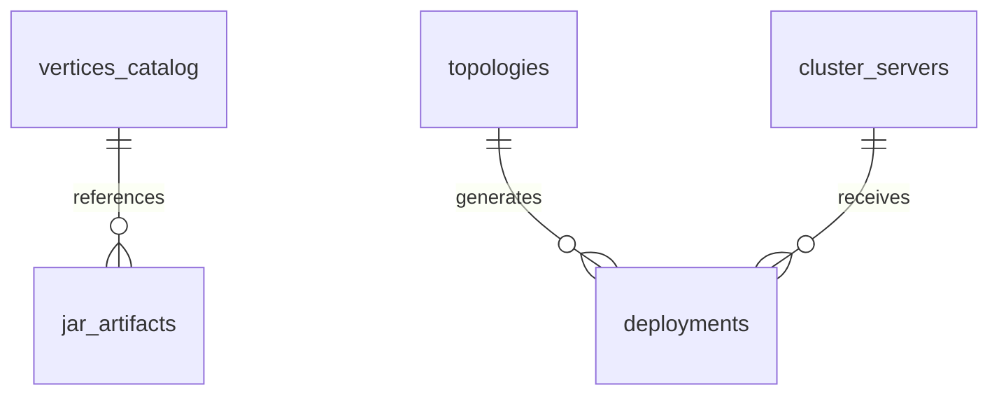

# 🪐 Topology Studio - Full-Stack Cluster Deployment Architecture & MongoDB REST API Reference

Topology Studio is a production-ready, full-stack visual graph & vertex network studio for designing, inspecting, auto-layouting, and deploying LLM neural network topologies across distributed server clusters.

---

## 🍃 MongoDB Database Architecture & Schemas (`mongodb://localhost:27017/topology_studio`)

Topology Studio connects to MongoDB via **Mongoose** (`models.js`, `db.js`), backing all application features with **5 Core Collections**:



### 1. 🧩 `vertices_catalog` Collection
Stores available component type presets, parameters, descriptions, and execution JAR metadata:
```javascript
{
  type: "RMS",                           // Primary Key component identifier
  label: "RMS Normalization",
  category: "Norm",
  description: "Root Mean Square Normalization layer.",
  badgeClass: "badge-purple",
  defaultHost: "192.168.0.196",
  defaultPort: 9001,
  defaultInternalPort: 10001,
  params: { eps: 0.000001, dim: 896 },
  jarInfo: { jarName: "rms-norm-service-v1.0.jar", sizeMb: 12.1, version: "1.0.0" }
}
```

### 2. 📦 `jar_artifacts` Collection
Stores metadata and checksums for executable JAR files in Central DB:
```javascript
{
  jarName: "rms-norm-service-v1.0.jar",
  type: "RMS",
  version: "1.0.0",
  sizeMb: 12.1,
  checksum: "sha256-a1b2c3d4e5...",
  contentType: "application/java-archive"
}
```

### 3. 🪐 `topologies` Collection
Stores active and saved user graph topologies:
```javascript
{
  name: "Default_Topology",
  isDefault: true,
  vertices: [
    {
      id: "RMS0",
      type: "RMS",
      host: "192.168.0.196",
      port: 9001,
      internalPort: 10001,
      params: { eps: 0.000001, dim: 896 },
      edges: ["K", "V"]
    }
  ],
  groups: [],
  positions: { "RMS0": { x: 80, y: 360 } }
}
```

### 4. 🚀 `deployments` Collection
Stores audit logs and execution manifests for cluster deployment runs:
```javascript
{
  deploymentId: "dep-1784928000000",
  deploymentName: "Cluster_Run_1",
  timestamp: ISODate("..."),
  summary: { totalVertices: 14, totalGroups: 2, totalUniqueServers: 3, totalJarsTransferred: 6 },
  serverDeployments: [
    {
      serverIp: "192.168.0.196",
      verticesCount: 5,
      vertexIds: ["RMS0", "K", "V"],
      jarsToTransfer: [ { jarName: "rms-norm-service-v1.0.jar", sizeMb: 12.1 } ],
      status: "JAR_TRANSFERRED_AND_TOPO_CONFIGURED"
    }
  ],
  globalTopologyBroadcast: { status: "BROADCASTED_TO_ALL_SERVERS", uploadedTopologySizeKb: 4.8 }
}
```

### 5. 🖥️ `cluster_servers` Collection
Stores registered server nodes and hardware telemetry:
```javascript
{
  serverIp: "192.168.0.196",
  hostname: "gpu-node-01.local",
  status: "ONLINE",
  cpuCores: 64,
  ramGb: 256,
  gpuName: "NVIDIA H100 80GB"
}
```

---

## ⌨️ Keyboard Shortcuts & Keybindings Reference

| Shortcut | Action | Description |
| :--- | :--- | :--- |
| `Delete` / `Backspace` | **Delete Selection** | Deletes selected vertex, vertices, or groups (ignored when typing in input boxes). |
| `Escape` (`Esc`) | **Cancel / Deselect** | Deselects canvas items, closes Inspector Sidebar, deployment modals, or JSON drawer. |
| `Ctrl + A` / `Cmd + A` | **Select All** | Selects all vertices on the canvas. |
| `Ctrl + G` / `Cmd + G` | **Group Vertices** | Groups selected vertices into 1 unit (requires 2+ selected items). |
| `Ctrl + Shift + G` | **Ungroup** | Dissolves selected group cards back into member nodes. |
| `Ctrl + L` / `Cmd + L` | **Auto Layout** | Calculates dynamic DAG topological levels and tidies canvas layout. |
| `Ctrl + D` / `Cmd + D` | **Deploy Cluster** | Triggers Cluster Deployment Pipeline modal. |
| `Ctrl + F` / `Cmd + F` | **Focus Search** | Opens and focuses Left Sidebar search input box. |
| `[` | **Toggle Left Sidebar** | Collapses or expands Left Components Sidebar. |
| `]` | **Toggle Inspector** | Slides open or closes Right Inspector Sidebar. |
| `+` / `=` | **Zoom In** | Zooms canvas view in. |
| `-` | **Zoom Out** | Zooms canvas view out. |
| `0` | **Fit View** | Resets canvas zoom & pans to fit the entire graph payload. |

---

## 📡 Backend REST API Specification (`server.js`)

All REST API endpoints are backed by MongoDB queries with graceful in-memory fallback.

### 1. Health Check Endpoint
* **Route**: `GET /api/health`
* **Description**: Verifies backend server health status and MongoDB connection state.
* **Response**: `{ "status": "ok", "version": "1.0.0", "mongoConnected": true }`

---

### 2. Vertices Catalog API (MongoDB `vertices_catalog`)
* **Route**: `GET /api/vertices/catalog`
* **Description**: Queries MongoDB catalog for available components and JAR binary metadata.
* **Query Params**: `q` (optional search string).

---

### 3. Active Topology Graph Endpoint (MongoDB `topologies`)
* **Route**: `GET /api/topology` | `POST /api/topology`
* **Description**: Reads / saves active graph topology in MongoDB.

---

### 4. Cluster Deployment Pipeline Endpoint (MongoDB `deployments`)
* **Route**: `POST /api/deploy/cluster`
* **Description**: Executes cluster deployment, transfers JAR binaries from Central DB to target server IPs, and saves run manifest in MongoDB `deployments` collection.

---

### 5. Deployment Audit History Endpoint (MongoDB `deployments`)
* **Route**: `GET /api/deploy/history`
* **Description**: Fetches deployment history logs from MongoDB.

---

### 6. Cluster Servers Registry Endpoint (MongoDB `cluster_servers`)
* **Route**: `GET /api/servers`
* **Description**: Fetches registered cluster server nodes and hardware telemetry.

---

## 🚀 How to Run

```bash
# Start Full-Stack Server
npm run start
```
👉 Access application at: **`http://localhost:3000/`**
