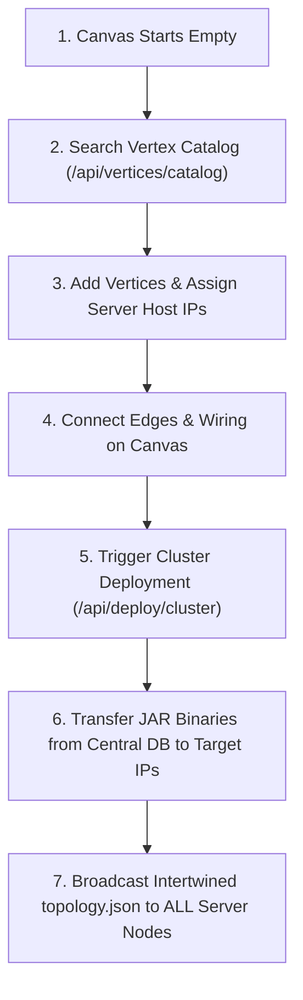

# 🪐 Topology Studio - Full-Stack Cluster Deployment Architecture & REST API Reference

Topology Studio is a production-ready, full-stack visual graph & vertex network studio for designing, inspecting, auto-layouting, and deploying LLM neural network topologies across distributed server clusters.

---

## ⌨️ Keyboard Shortcuts & Keybindings Reference

| Shortcut | Action | Description |
| :--- | :--- | :--- |
| `Delete` / `Backspace` | **Delete Selection** | Deletes selected vertex, vertices, or groups (ignored when typing in input boxes). |
| `Escape` (`Esc`) | **Cancel / Deselect** | Deselects canvas items, closes Inspector Sidebar, deployment modals, or JSON drawer. |
| `Ctrl + A` / `Cmd + A` | **Select All** | Selects all vertices on the canvas. |
| `Ctrl + G` / `Cmd + G` | **Group Vertices** | Groups selected vertices into 1 unit (requires 2+ selected items). |
| `Ctrl + Shift + G` | **Ungroup** | Dissolves selected group cards back into member nodes. |
| `Ctrl + L` / `Cmd + L` | **Auto Layout** | Calculates dynamic DAG topological levels and tidies canvas layout. |
| `Ctrl + D` / `Cmd + D` | **Deploy Cluster** | Triggers Cluster Deployment Pipeline modal. |
| `Ctrl + F` / `Cmd + F` | **Focus Search** | Opens and focuses Left Sidebar search input box. |
| `[` | **Toggle Left Sidebar** | Collapses or expands Left Components Sidebar. |
| `]` | **Toggle Inspector** | Slides open or closes Right Inspector Sidebar. |
| `+` / `=` | **Zoom In** | Zooms canvas view in. |
| `-` | **Zoom Out** | Zooms canvas view out. |
| `0` | **Fit View** | Resets canvas zoom & pans to fit the entire graph payload. |

---

## 🏗️ Architectural Workflow

The application operates according to the following workflow:



1. **Empty Canvas Startup**: The canvas starts clean & empty by default so users construct custom topologies from scratch.
2. **Searchable Vertex Catalog**: The Left Sidebar queries the Central Database via `GET /api/vertices/catalog` to retrieve available vertex components along with their description, default ports, and required `.jar` binary metadata (e.g. `rms-norm-service-v1.8.jar`).
3. **Adding Vertices & Assigning Server IPs**: When a vertex is selected or added to the canvas, the user assigns a Server IP address (`host`) to it in the Inspector panel. **Multiple vertices can run on a single server IP** (co-located on different ports).
4. **Deploying Topology & JAR Distribution**:
   - Clicking **Deploy Cluster** (or pressing `Ctrl+D`) triggers the core deployment pipeline (`POST /api/deploy/cluster`).
   - The backend extracts all unique target server IPs assigned in the topology.
   - For each server IP, the backend identifies the required `.jar` binaries corresponding to its assigned vertices and executes/simulates transferring those JAR files from the Central DB to the target server IP.
   - The backend broadcasts the complete, intertwining global graph JSON (`topology.json`) to **ALL** assigned target servers so every node in the cluster maintains full global awareness of the intertwined data flow graph.

---

## 📡 Backend REST API Specification (`server.js`)

All REST API endpoints are consolidated in **`server.js`** with extensive inline JSDoc comments.

### 1. Health Check Endpoint
* **Route**: `GET /api/health`
* **Description**: Verifies backend server health status and version.
* **Request Query / Body**: None.
* **Response Payload**:
  ```json
  {
    "status": "ok",
    "version": "1.0.0",
    "timestamp": "2026-07-24T09:50:00.000Z"
  }
  ```

---

### 2. Vertices Catalog API (Central Database Query)
* **Route**: `GET /api/vertices/catalog`
* **Description**: Returns available vertex component definitions along with execution JAR binary metadata.
* **Request Query Parameters**:
  - `q` (optional string): Search filter for label, type, category, or description.
* **Response Payload**:
  ```json
  {
    "catalog": [
      {
        "type": "RMS",
        "label": "RMS Normalization",
        "category": "Norm",
        "description": "Root Mean Square Normalization layer",
        "jarInfo": { "jarName": "rms-norm-service-v1.8.jar", "sizeMb": 12.1, "version": "1.8.2" },
        "defaultHost": "192.168.0.196",
        "defaultPort": 9001,
        "defaultInternalPort": 10001,
        "badgeClass": "badge-purple",
        "params": { "eps": 0.000001, "dim": 896 }
      }
    ]
  }
  ```

---

### 3. Active Topology Graph Endpoint
* **Route**: `GET /api/topology`
* **Description**: Returns the active canvas topology graph payload.
* **Request Query / Body**: None.
* **Response Payload**:
  ```json
  {
    "vertices": [
      {
        "id": "RMS0",
        "type": "RMS",
        "host": "192.168.0.196",
        "port": 9001,
        "internalPort": 10001,
        "params": { "eps": 0.000001, "dim": 896 },
        "edges": ["K", "V"]
      }
    ],
    "groups": [],
    "positions": { "RMS0": { "x": 100, "y": 200 } }
  }
  ```

---

### 4. Save Topology Graph Endpoint
* **Route**: `POST /api/topology`
* **Description**: Persists updated graph payload to backend storage.
* **Request Body Payload**:
  ```json
  {
    "vertices": [ ... ],
    "groups": [ ... ],
    "positions": { ... }
  }
  ```
* **Response Payload**:
  ```json
  {
    "success": true,
    "message": "Active topology graph updated successfully",
    "vertexCount": 1
  }
  ```

---

### 5. Cluster Deployment Pipeline Endpoint (Core Deployment API)
* **Route**: `POST /api/deploy/cluster`
* **Description**: Executes the cluster deployment pipeline:
  1. Identifies unique target server IPs assigned by the user.
  2. Resolves required JAR binaries from Central DB for each target IP.
  3. Executes JAR transfers from Central DB to each target server IP.
  4. Broadcasts complete intertwining `topology.json` to ALL target servers.
* **Request Body Payload**:
  ```json
  {
    "vertices": [ ... ],
    "groups": [ ... ],
    "deploymentName": "Cluster_Run_1"
  }
  ```
* **Response Payload**:
  ```json
  {
    "success": true,
    "message": "Successfully deployed topology graph across 2 target server IPs.",
    "manifest": {
      "deploymentId": "dep-1784928000000",
      "deploymentName": "Cluster_Run_1",
      "timestamp": "2026-07-24T09:50:00.000Z",
      "summary": {
        "totalVertices": 4,
        "totalGroups": 0,
        "totalUniqueServers": 2,
        "totalJarsTransferred": 4
      },
      "serverDeployments": [
        {
          "serverIp": "192.168.0.196",
          "verticesCount": 3,
          "vertexIds": ["RMS0", "K", "V"],
          "jarsToTransfer": [
            { "jarName": "rms-norm-service-v1.8.jar", "sizeMb": 12.1 },
            { "jarName": "kv-projection-engine-v3.0.jar", "sizeMb": 24.6 }
          ],
          "status": "JAR_TRANSFERRED_AND_TOPO_CONFIGURED"
        }
      ],
      "globalTopologyBroadcast": {
        "status": "BROADCASTED_TO_ALL_SERVERS",
        "uploadedTopologySizeKb": 2.4,
        "nodesCount": 4,
        "dataFlowIntegrity": "VERIFIED_INTERTWINED_GRAPH"
      }
    }
  }
  ```

---

## 🚀 How to Run

### Production Full-Stack Server
```bash
npm run start
```
👉 Access application at: **`http://localhost:3000/`**

### Development Mode
```bash
# Terminal 1: Backend Server (Port 3000)
npm run server

# Terminal 2: Frontend Dev Server (Port 5173)
npm run dev
```
